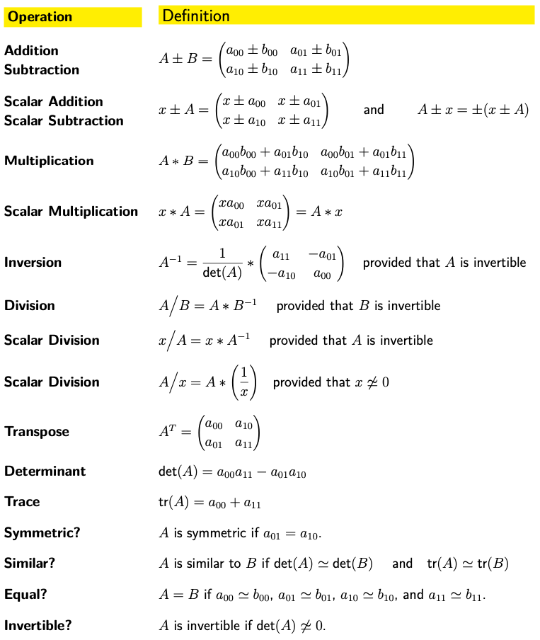

# matrix-operation
This program implements the common mathematical operations for a 2x2 matrix. The operations
are first implemented using helper methods. Then, common operators are overloaded to implement the
operations for our matrix type.

## Implemented Operations:


# How to Run
In the main.cpp file, run the program normally to test the class and its methods.

# Sample Output
```txt
m1
|   2        -1      |
|   1        2       |

m1.inverse()
|   0.4      0.2     |
|   -0.2     0.4     |

m1 * m1.inverse()
|   1        0       |
|   0        1       |

m1.inverse() * m1
|   1        0       |
|   0        1       |

det(m1) =   5
trace(m1) = 4

m1 is invertible
|   2        -1      |
|   1        2       |

```
